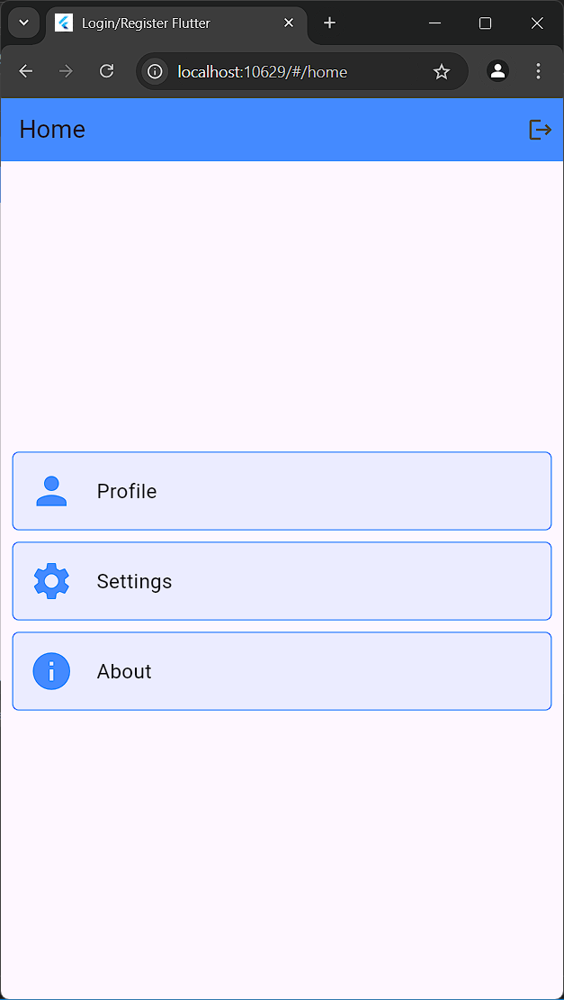

# UTS Flutter

- **Nama : M.Ismatullah.S.S**
- **NIM : 2141720010**

## Fitur Utama
- **Login dan Registrasi**
- **Profil Pengguna**


## Screenshots
Berikut adalah tampilan dari aplikasi:

### Screenshot 1


### Screenshot 2


### Screenshot 3


### Screenshot 4


## Teknologi yang Digunakan
- **Flutter**: Framework untuk membangun aplikasi mobile.
- **Dart**: Bahasa pemrograman yang digunakan dalam pengembangan aplikasi Flutter.
- **Git**: Versi kontrol untuk manajemen kode sumber.

###
1. **Clone Repository**
   ```bash
   git clone https://github.com/Rimuren/uts_flutter.git
